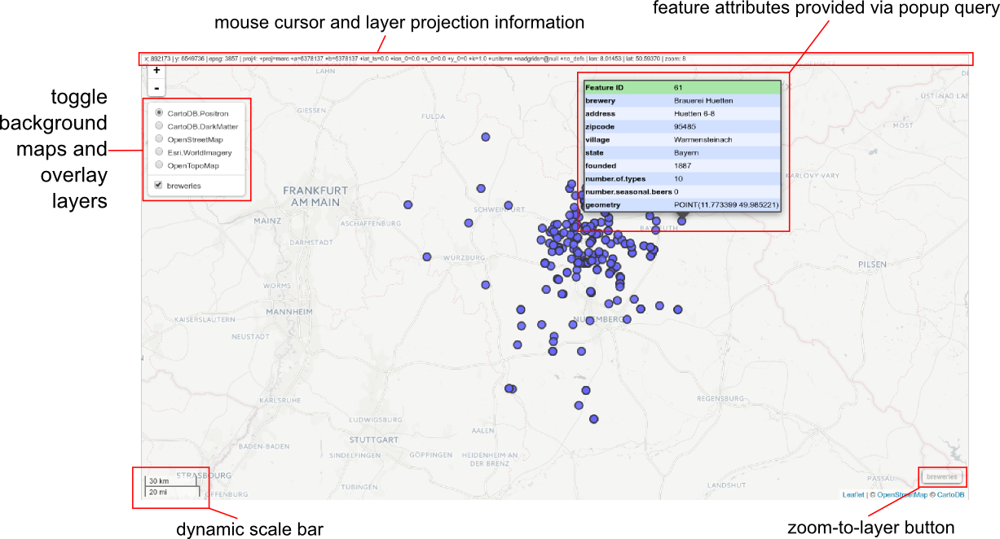

# mapview #

### Interactive viewing of spatial objects in R ###

[](https://travis-ci.org/environmentalinformatics-marburg/mapview)
 
[](https://cran.r-project.org/package=mapview)
[](http://www.gnu.org/licenses/gpl-3.0.html)

------------

**mapview** is an R package created to help researchers during their spatial data analysis workflow. It provides functions to very quickly and conveniently create interactive visualisations of spatial data. It was created to fill the gap of quick (not presentation grade) interactive plotting to examine and visually investigate both aspects of spatial data, the gometries and their attributes.

The main user relevant functions are:

* `mapview` - view potentially multiple spatial objects on a set of background maps
* `viewExtent` - view extent / bounding box of spatial objects
* `viewRGB` - view RGB true- or false-color images of raster objects
* `latticeView` & `sync` - view small multiples of several potentially synchronised maps
* `slideView` - view two overlaid raster objects with a horizontal slider to hide/reveal one of them
* `cubeView` - 3D view of raster data cubes (e.g. space-time cube) with keyboard control over position of slices
* `plainview` - view large rasters on a plain background (i.e. no background map)
* `mapshot` - easily save maps (including leaflet maps) as `html` or `png` (or other image formats)

Objects of the following spatial classes are supported:

* [sf](https://cran.r-project.org/package=sf) (XY dimesnion only)
* [raster](https://cran.r-project.org/package=raster) (Layer, Stack, Brick and SpatialPixels* / SpatialGridDataFrame)
* [sp](https://cran.r-project.org/package=sp) (Points, Polygons, Lines and their DataFrame version)
* [satellite](https://cran.r-project.org/package=satellite)


In addition, **mapview** provides some extra leaflet compatible functionality:

* `addHomeButton` - add zoom-to-layer buttons 
* `addLogo` - add a logo (or any image really) to a map
* `addMouseCoordinates` - add mouse cursor postion information when moving over the map
* `addLargeFeatures` - add large data to a map that would otherwise make the leaflet map irresponsive
* `popupTable`, `popupGraph` & `popupImage` - popups of tables, grpahs and images for use with the leaflet `add*` functions


## Installation ##

For CRAN release version of **mapview** use


```S
install.packages("mapview")
```


To install the development version install the [devtools](https://cran.r-project.org/package=devtools) package.

```S
devtools::install_github("environmentalinformatics-marburg/mapview@develop")
```


## Usage ##

The most basic call

```S
mapview(breweries)
```

will produce a web map visualisation of the breweries data that looks like this:




## Contact ##

Please file bug reports and feature requests at https://github.com/environmentalinformatics-marburg/mapview/issues
